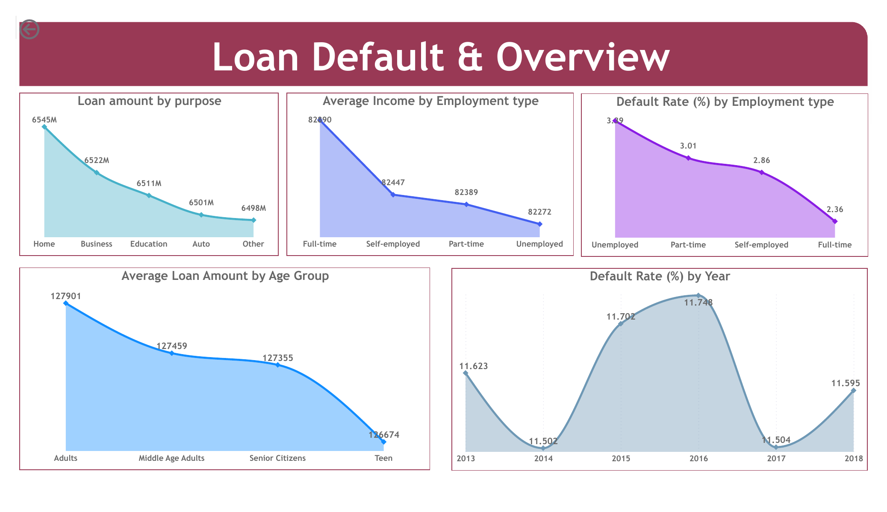
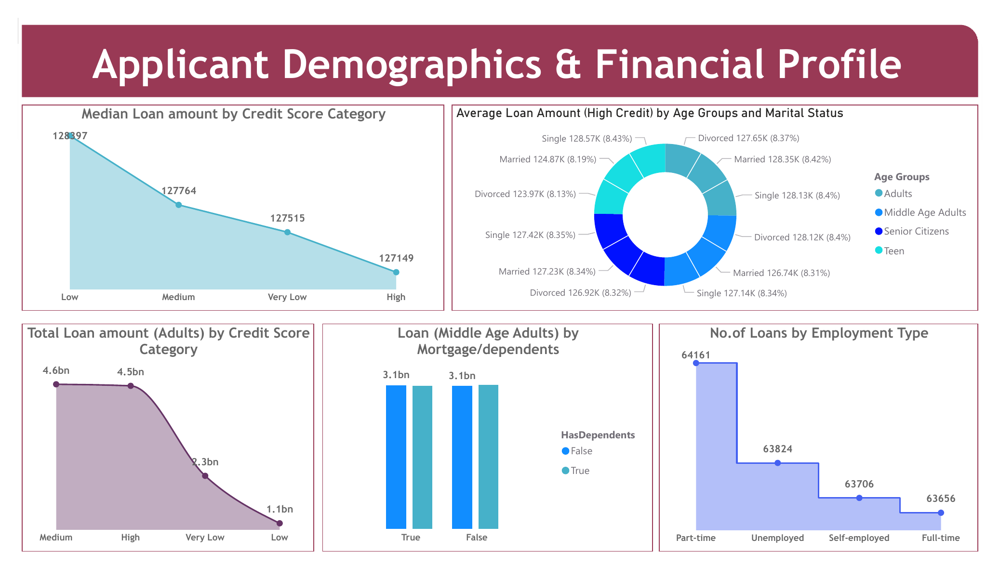
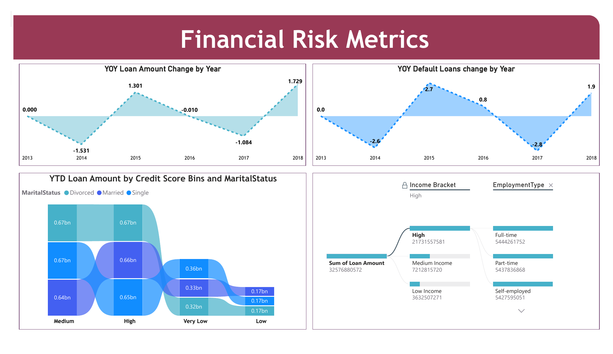
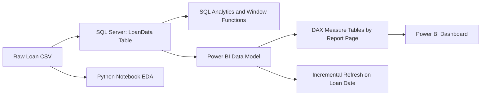

# Loan Default Risk Analytics | SQL Server + Python + Power BI


## Project Overview

This project is an end-to-end loan default risk analytics solution that converts raw loan-level data into business-ready insights using **Python EDA**, **SQL Server analytics**, and an interactive **Power BI dashboard**. The Power BI model uses **SQL Server as the source**, includes **incremental refresh**, and organizes DAX calculations into separate **measure tables for each report page** to improve model maintainability.

The project is designed for portfolio monitoring, underwriting risk analysis, and executive decision support.

## Dashboard Preview

<p align="center">
  
</p>

<p align="center">
  
</p>

<p align="center">
  
</p>

## Business Problem

Financial institutions need to understand which borrowers, loan products, and financial profiles are more likely to default. This project answers key business questions such as:

- Which customer segments have the highest default risk?
- Which loan purposes contribute the most exposure and risk?
- How do credit score, income, employment type, and age influence default behavior?
- Are defaults increasing or decreasing over time?
- Are there hidden-risk borrowers who look financially strong but still default?
- Which Power BI metrics should executives monitor regularly?

## Solution Architecture



## Tech Stack

| Layer | Tools / Skills Used |
|---|---|
| Data Source | CSV loaded into SQL Server |
| Database | SQL Server, SQL window functions, CTEs, ranking, cohort analysis |
| EDA | Python, pandas, matplotlib, seaborn |
| BI Modeling | Power BI, Power Query, DAX, measure tables |
| Performance | Incremental refresh using date-based filtering |
| Visualization | Power BI dashboard with 3 analytical pages |
| Documentation | Project report, GitHub README, dashboard screenshots |

## Dataset Summary

| Metric | Value |
|---|---:|
| Records | 255,347 loans |
| Original Columns | 19 |
| Date Range | 2013 to 2018 |
| Missing Values | 0 |
| Duplicate Loan IDs | 0 |
| Total Loan Amount | $32.58B |
| Overall Default Rate | 11.61% |
| Defaulted Loans | 29,653 |
| Average Loan Amount | $127,579 |
| Median Loan Amount | $127,556 |

## Key Business Insights

1. **Overall portfolio risk is stable but material.** The portfolio default rate is **11.61%**, with yearly default rates staying between **11.50% and 11.75%** from 2013 to 2018.
2. **Business loans have the highest default rate by purpose.** Business loans default at **12.33%**, while Home loans are the lowest-risk purpose at **10.24%**.
3. **Unemployed borrowers are the highest-risk employment segment.** Unemployed borrowers show a **13.55%** within-segment default rate, compared with **9.46%** for Full-time borrowers.
4. **Younger borrowers carry significantly higher risk.** Teen borrowers show the highest default rate at **22.14%**, while Senior Citizens show the lowest at **5.13%**.
5. **Low income is the strongest risk segment.** Borrowers with income below **$30K** default at **21.96%**. However, the High Income bracket still represents the largest exposure at **$21.73B**.
6. **Credit score still matters.** The lowest credit-score quartile has a **13.06%** default rate, while the highest quartile has **10.19%**.
7. **Income alone is not enough for underwriting.** The SQL cohort analysis identified **11,823 hidden-risk borrowers** who defaulted despite earning more than the average income of their Education and Employment Type cohort.
8. **Defaulters look materially different from non-defaulters.** Defaulters have lower average income, higher average loan amounts, higher interest rates, lower credit scores, and shorter employment history.
9. **Co-signer, dependents, and mortgage indicators are useful risk signals.** Borrowers without a co-signer, dependents, or mortgage show higher default rates than borrowers with those risk mitigants.

## Business Questions Answered

| # | Business Question | Analysis Method | Main Insight |
|---:|---|---|---|
| 1 | How risky is the overall loan portfolio? | Portfolio KPIs and default distribution | Default rate is 11.61% across 255,347 loans. |
| 2 | Which loan purposes drive the highest risk? | Grouped default rate by LoanPurpose | Business loans have the highest default rate at 12.33%. |
| 3 | Which employment types are riskiest? | Segment-level default rate by EmploymentType | Unemployed borrowers have the highest default rate at 13.55%. |
| 4 | How does age affect loan behavior? | Age-group segmentation | Teen borrowers default at 22.14%; Senior Citizens default at 5.13%. |
| 5 | Do credit score tiers separate risk? | SQL NTILE(4) risk bands | Lowest credit quartile defaults at 13.06% vs 10.19% for highest quartile. |
| 6 | Are there hidden-risk customers? | SQL cohort average income comparison | 11,823 high-income relative-to-cohort borrowers still defaulted. |
| 7 | How do defaults change over time? | Yearly trend and YoY measures | Yearly default rate is stable; 2016 peaked at 11.75%. |
| 8 | Which profiles should be prioritized for monitoring? | SQL DENSE_RANK by income bracket, marital status, and employment type | Low-income Single/Unemployed and Divorced/Unemployed borrowers are among the riskiest profiles. |

## Power BI Report Pages

| Page | Purpose | Example Measures / Visuals |
|---|---|---|
| Loan Default & Overview | Executive portfolio view | Loan amount by purpose, average income by employment type, default rate by year, age-group loan amount |
| Applicant Demographics & Financial Profile | Borrower segmentation | Credit score category, age group, marital status, mortgage/dependents, loans by employment type |
| Financial Risk Metrics | Risk trend and exposure monitoring | YoY loan amount change, YoY default loan change, YTD loan amount by credit score and marital status, income bracket exposure |

## Power BI Engineering Highlights

- **SQL Server source:** Power BI connects to SQL Server instead of a flat file, which mirrors an enterprise BI workflow.
- **Incremental refresh:** The report is configured to refresh only new or changed date partitions based on the loan date field.
- **Page-specific measure tables:** DAX measures are organized into separate tables by report page, making the model easier to maintain and review.
- **Reusable DAX KPIs:** Measures include total loans, total loan amount, default loans, default rate, YoY changes, YTD loan amount, and segment-level calculations.
- **Dashboard layout:** The report uses separate pages for portfolio overview, borrower profile analysis, and financial risk metrics.

### Suggested Measure Table Organization

| Measure Table | Example Measures |
|---|---|
| Measures - Loan Default & Overview | Total Loans, Total Loan Amount, Default Loans, Default Rate %, Average Income, Average Loan Amount |
| Measures - Applicant Demographics | Median Loan Amount, Loan Count by Employment Type, High Credit Loan Amount, Credit Score Category Metrics |
| Measures - Financial Risk Metrics | YOY Loan Amount Change %, YOY Default Loans Change %, YTD Loan Amount, Income Bracket Exposure |

### Example DAX Measures

```DAX
Total Loans = COUNTROWS(LoanData)

Total Loan Amount = SUM(LoanData[LoanAmount])

Default Loans =
CALCULATE(
    COUNTROWS(LoanData),
    LoanData[Default] = 1
)

Default Rate % =
DIVIDE([Default Loans], [Total Loans])

YOY Loan Amount Change % =
VAR CurrentYearAmount = [Total Loan Amount]
VAR PreviousYearAmount =
    CALCULATE(
        [Total Loan Amount],
        DATEADD('Date'[Date], -1, YEAR)
    )
RETURN
DIVIDE(CurrentYearAmount - PreviousYearAmount, PreviousYearAmount)
```

## SQL Analysis Highlights

The SQL script includes business-driven queries using CTEs, window functions, and ranking logic:

- **Credit score risk tiers:** `NTILE(4)` creates four equal borrower risk bands.
- **Hidden-risk detection:** Cohort-level average income is calculated with `AVG() OVER(PARTITION BY Education, EmploymentType)`.
- **Business loan pricing trend:** Year-over-year average interest rate with cumulative running average.
- **Large-loan DTI comparison:** Defaulter vs non-defaulter DTI is compared for loans above the portfolio average.
- **Top risky profiles:** `DENSE_RANK()` identifies the top 3 riskiest marital-status and employment-type combinations per income bracket.

## How to Reproduce

1. **Load the dataset into SQL Server** as a table named `LoanData`.
2. **Validate schema and data quality** using the notebook or SQL checks.
3. **Run `loan_analysis.sql`** to answer the advanced business questions.
4. **Open the Power BI file** and connect it to the SQL Server source.
5. **Configure incremental refresh** using `RangeStart` and `RangeEnd` parameters on the loan date field.
6. **Refresh the model** and review the three report pages.
7. **Run the Python notebook** for EDA validation and additional statistical analysis.

## Data Dictionary

| Column | Description |
|---|---|
| LoanID | Unique loan identifier |
| Age | Borrower's age when the loan was issued |
| Income | Borrower's annual income |
| LoanAmount | Approved or requested loan amount |
| CreditScore | Borrower's creditworthiness score |
| MonthsEmployed | Months employed at current job or employer |
| NumCreditLines | Number of active credit lines |
| InterestRate | Annual percentage rate on the loan |
| LoanTerm | Loan repayment term in months |
| DTIRatio | Debt-to-income ratio |
| Education | Highest completed education level |
| EmploymentType | Employment category |
| MaritalStatus | Borrower's marital status |
| HasMortgage | Whether the borrower has a mortgage |
| HasDependents | Whether the borrower has dependents |
| LoanPurpose | Main reason for the loan |
| HasCoSigner | Whether the loan has a co-signer |
| Default | Target variable: 1 means default, 0 means no default |
| Loan Date | Loan issue or origination date |

## Business Recommendations

- Prioritize monitoring for borrowers who are **low income, unemployed, young, without a co-signer, and without dependents or mortgage history**.
- Use **segment-level default rates**, not only overall default rate, to refine underwriting policy.
- Investigate **high-income hidden-risk borrowers** because income alone does not guarantee repayment reliability.
- Add Power BI drillthrough pages for borrower profile deep dives.
- Add predictive modeling as a future phase to estimate default probability before approval.
- Create a data quality checklist for consistent date parsing, default encoding, and metric naming.

## Skills Demonstrated

- End-to-end analytics workflow from raw data to executive dashboard
- SQL Server data source integration with Power BI
- Incremental refresh implementation for scalable reporting
- DAX measure organization using page-specific measure tables
- SQL window functions, CTEs, cohort analysis, and ranking
- Python EDA and statistical validation
- Business storytelling with actionable risk insights
